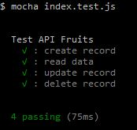

### Tutorial 101: Testing RESTful CRUD with Mocha Chai

Hi! welcome to Tutorial 101..
in this tutorial we will learn about how to build testing code for RESTful API CRUD with Mocha Chai. This tutorial is extended series of [Tutorial 101: ExpressJS RESTful CRUD with Mongoose](https://github.com/digachandra/Tutor101-ExpressJS-RESTful-CRUD-with-Mongoose "Tutorial 101: ExpressJS RESTful CRUD with Mongoose"). So let's get started!

---
#### NOTE

**It is totally recommended, if we build testing code first before we code another business requirement**

---

#### 1. Installation

Remember we need to clone or duplicate previous repository, then install the required packages

```
npm install
npm install -S chai chai-http
npm install -D mocha
```

#### 2. Build skeleton

create testing js file **.test.js**, in this case we will create **index.test.js**

```
├── config
│   └── database.js
├── controllers
│   └── fruits.js
├── models
│   └── fruits.js
├── routes
│   └── api.js
├── .gitignore
├── index.js
└── index.test.js
```

#### 3. Init index.test.js

```
'use strict'

const chai = require('chai'),
    chaiHttp = require('chai-http'),
    should = chai.should(),
    expect = chai.expect

chai.use(chaiHttp)

describe('Test API Fruits', function(){
  var id, url = 'http://localhost:9000'
  it(': create record', function(done){
    chai.request(url)
        .post('/fruits')
        .send({
          name: 'Apple'
        })
        .end(function(err, res){
          expect(res).to.have.status(200)
          id = res.body._id;
          done()
        })
  })
  it(': read data', function(done){
    chai.request(url)
        .get('/fruits')
        .end(function(err, res){
          expect(res).to.have.status(200)
          done()
        })
  })
  it(': update record', function(done){
    chai.request(url)
        .put(`/fruits/${id}`)
        .send({
          title: 'Delicious Apple'
        })
        .end(function(err, res){
          expect(res).to.have.status(200)
          done()
        })
  })
  it(': delete record', function(done){
    chai.request(url)
        .delete(`/fruits/${id}`)
        .end(function(err, res){
          expect(res).to.have.status(200)
          done()
        })
  })
})
```

#### 4. Start MongoDb

If you do not know how to get started with MongoDB, you can access these following links

1. [MongoDB Documentation](https://docs.mongodb.com/ "MongoDB documentation")
2. [MongoDB Tutorial for Beginners](https://www.tutorialspoint.com/mongodb/index.htm "MongoDB Tutorial for Beginners")

#### 5. Start the engine!

```
node index.js
```

#### 6. Start testing with Mocha & Chai

You can learn more about Mocha and Chai by following these links:

1. [MochaJS Website](https://mochajs.org/ "MochaJS Website")
2. [ChaiJS Website](http://chaijs.com/ "ChaiJS Website")

```
mocha index.test.js
```

and it should be get result like this


